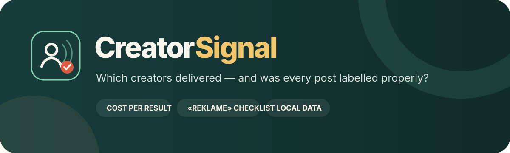
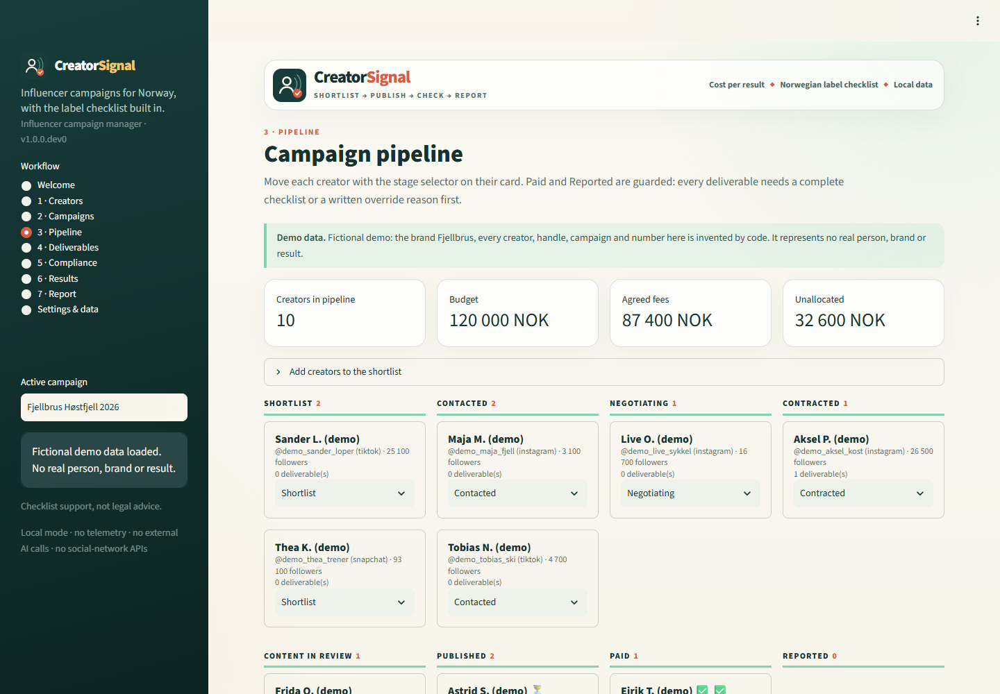
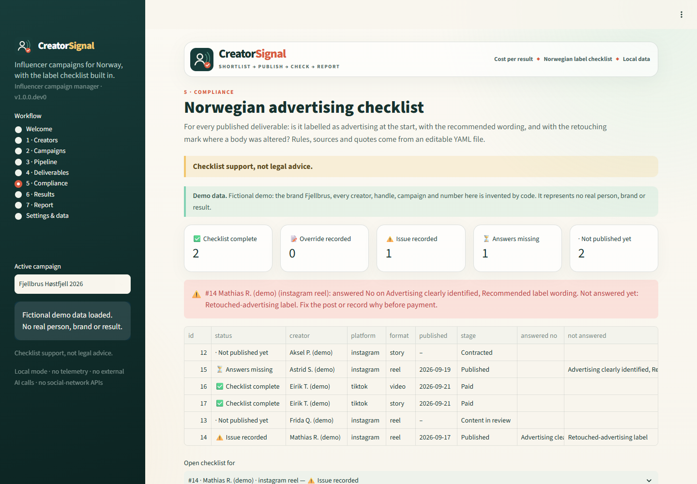

<p align="center">
  
</p>

<p align="center">
  
  
  
  <a href="LICENSE"></a>
</p>

<p align="center"><strong>Run Norwegian influencer campaigns in one local app — pipeline, codes, cost per result, and an advertising-label checklist on every post.</strong></p>

> **Status:** v1 in development (`1.0.0.dev0`). Private build; not yet released.

**CreatorSignal** is an open, local-first influencer campaign manager for the Norwegian market — a free alternative to paid tools such as Upfluence, Grin and Modash for small brands, agencies and student projects. It answers:

> Which creators delivered for this campaign, at what cost per result — and was every post correctly labelled under Norwegian rules?

Everything runs on your own computer with open-source Python packages and saves to one SQLite file you choose. There is no account, telemetry, external AI call, cloud upload or social-network API.

<p align="center"></p>

## Read this first

- **Checklist support, not legal advice.** The compliance checklist records what your team checked against Forbrukertilsynet's published guidance. It never says a post or campaign is "compliant", and it is no substitute for a legal assessment.
- **Numbers are descriptive, not causal.** CPM, CPC, cost per redemption and ROAS describe what was reported against what was paid. Some buyers would have bought anyway; discount codes leak to coupon sites; views are defined differently by each platform. The app says so next to the numbers.
- **Nothing is fetched.** Follower counts, engagement rates and results are what you or the creator enter. CreatorSignal never scrapes profiles, never sends DMs and never calls a platform API.
- **You hold personal data.** Creator names, contacts and fees are personal data under GDPR, and you are the data controller. See [PRIVACY.md](PRIVACY.md).

## Try the fictional demo in three minutes

1. **Windows:** double-click `run_app.bat`. The first start creates a private Python environment, installs the packages and opens the app with the demo already loaded.
2. Open **3 · Pipeline** with *Fjellbrus Høstfjell 2026* active. Ten fictional creators sit across the stages. Move *Mathias R. (demo)* to **Paid** — the gate refuses, because his published post has no advertising label.
3. Open **5 · Compliance**. The warning names the failing rules. Open the checklist to see each rule in Norwegian and English with its source link and quote.
4. Switch the sidebar to *Fjellbrus Vårløp 2026* and open **6 · Results**: cost per result by creator, with the limits of each number spelled out.
5. Open **7 · Report** and download the XLSX workbook and the one-page HTML summary (print it to PDF from the browser).

**The demo is fictional.** The brand Fjellbrus, the 25 creators (handles all start with `demo_`, e-mails use `example.com`), both campaigns and every number are generated by code ([`src/creatorsignal/demo.py`](src/creatorsignal/demo.py), fixed seed). They represent no real person, brand or result.

<p align="center"></p>

## What it does (v1)

| Area | What you get |
|---|---|
| **Creators** | Roster with handles on Instagram, TikTok, YouTube and Snapchat, followers, engagement rate, niche tags, county (fylke), contact, rate card and notes. CSV/XLSX import with validation, CSV export. |
| **Campaigns** | Name, brand, goal (awareness / traffic / sales), budget in NOK, dates, brief, deliverables template, landing page and category. |
| **Pipeline** | Shortlist → Contacted → Negotiating → Contracted → Content in review → Published → Paid → Reported, moved with a select box on each card. Every move is logged. |
| **Deliverables** | Platform, format (reel, story, post, video), due date, agreed fee, discount code and a tracked link. |
| **Compliance** | A Norwegian advertising checklist per published deliverable. A creator cannot move to *Paid* or *Reported* until every deliverable's checklist is complete or someone writes an override reason. |
| **Results** | Reach, views, clicks, code redemptions and revenue by hand or CSV. CPM, CPC, cost per redemption and ROAS per creator and per campaign. |
| **Report** | XLSX workbook (every table, checklist answers, rule sources) and a one-page HTML summary. |

### Tracked links

Every link uses one scheme, so campaigns stay comparable in your analytics:

```
<landing page>?utm_source=<platform>&utm_medium=influencer&utm_campaign=<campaign slug>&utm_content=<creator handle>
```

Existing query parameters on the landing page are kept; old `utm_*` parameters are replaced. Norwegian letters are transliterated (æ → ae, ø → o, å → a).

## The Norwegian checklist

The rules live in [`src/creatorsignal/rules/no.yaml`](src/creatorsignal/rules/no.yaml) and can be edited without code changes. Each rule has an id, a Norwegian and English label and question, when it applies, the check type, the legal basis and its sources, each with an official URL and a quoted passage fetched on 1 October 2026.

| Rule | Applies to | Source |
|---|---|---|
| Advertising clearly identified at the start, visible without "more" | every published deliverable | [Forbrukertilsynet's guide to labelling advertising in social media](https://www.forbrukertilsynet.no/lov-og-rett/veiledninger-og-retningslinjer/someveiledning) (updated 18 May 2026); markedsføringsloven § 8 |
| Label wording: «reklame» or «annonse» (not «sponset», «i samarbeid med», …) | every published deliverable | same guide |
| Every story frame labelled, not only the first | stories | same guide |
| Retouched-advertising mark when body shape, size or skin is altered (filters included) | deliverables that show a person | [Forbrukertilsynet: merking av retusjert reklame](https://www.forbrukertilsynet.no/vi-jobber-med/merking-av-retusjert-reklame); markedsføringsloven § 2, in force 1 July 2022 |
| Restricted category flag: alcohol, gambling, tobacco/nicotine, targets children | campaigns in those categories | alkoholloven § 9-2, tobakksskadeloven § 22, Lotteri- og stiftelsestilsynet, Forbrukertilsynet |

Note on legal references: older material cites markedsføringsloven § 3 for advertising labelling. Since 1 October 2023, § 3 concerns documentation of claims, and Forbrukertilsynet's guide cites § 8 (first paragraph). CreatorSignal follows the guide. Details the official pages did not state clearly are marked `TODO(verify)` in the YAML — see [docs/compliance-rules.md](docs/compliance-rules.md).

## Data contract

**Workspace.** One SQLite file, by default `./data/creatorsignal.db` (git-ignored). Choose another folder on **Settings & data** or with `CREATORSIGNAL_DATA_DIR`. A brand-new default workspace starts with the demo; set `CREATORSIGNAL_NO_DEMO=1` to start empty.

**Creator CSV/XLSX.** Columns: `name` (required), `instagram`, `tiktok`, `youtube`, `snapchat`, `followers`, `engagement_rate` (percent, 0–100), `niche_tags` (comma separated), `region`, `contact_email`, `contact_phone`, `rate_card`, `notes`. Comma or semicolon separators and decimal commas (`4,2`) are accepted; a leading `@` on handles is removed. `region` must be one of Norway's 15 counties from 2024. Rows are rejected with their row number for missing names, impossible handles, non-numeric or negative counts, out-of-range engagement, unknown counties, malformed e-mail addresses, and duplicate names or handles. Rows whose name already exists update that creator.

**Results CSV/XLSX.** Download the template from **6 · Results**: `deliverable_id` plus any of `reach`, `views`, `clicks`, `redemptions`, `revenue_nok`. Blank cells are left unchanged.

**Metrics.** CPM = fee ÷ views × 1,000. CPC = fee ÷ clicks. Cost per redemption = fee ÷ redemptions. ROAS = code-attributed revenue ÷ fee. Each metric counts only the fees of deliverables that reported its denominator, so a missing number never makes the rest look cheaper. A zero or missing denominator gives "–", not infinity.

Exports (CSV and XLSX) are sanitized against spreadsheet formula injection. Uploads are limited to 20 MB, 50,000 rows and 100 columns.

## Limits

- No discovery, scraping, outreach, payments or multi-user accounts — by design in v1.
- Results are self-reported. Platform analytics, screenshots and shop data disagree; record which source you used in the notes.
- One stage per creator per campaign. Deliverables carry their own checklist; the Paid gate checks all of them together.
- The restricted-category flag is a flag only. It links the source and records that someone reviewed the rules; it does not assess them.
- The SQLite file has no access control. Protect it like any file with personal data.

## Run locally

You need Python 3.10 or newer.

**Windows:** double-click `run_app.bat`. It opens `http://127.0.0.1:8590`. Set `CREATORSIGNAL_PORT` to use another port.

Or from a terminal:

```bash
python -m venv .venv
source .venv/bin/activate  # Windows: .venv\Scripts\activate
python -m pip install -r requirements.txt
python -m streamlit run app.py --server.port=8590
```

Set `CREATORSIGNAL_DEBUG=1` to show technical details for unexpected errors, and `CREATORSIGNAL_RULES=<path>` to load a different rules YAML.

### Docker

```bash
docker build -t creatorsignal .
docker run --rm -p 8590:8590 -v creatorsignal-data:/data creatorsignal
```

The container runs as a non-root user, stores the database in the `/data` volume and includes a health check. It has no authentication — do not expose it beyond your own machine without adding access control (see [SECURITY.md](SECURITY.md)).

## Architecture

- `src/creatorsignal/` — all logic, data models and storage, pip-installable, **no Streamlit imports**. Public API in [`__init__.py`](src/creatorsignal/__init__.py).
- `src/creatorsignal/storage.py` — the only module that touches SQLite, so the backend can be swapped.
- `app.py` — the Streamlit UI; it only calls package functions.
- `tests/test_architecture.py` fails if any file under `src/` imports Streamlit or if SQLite leaks outside `storage.py`.

## Development checks

```bash
python -m pip install -e ".[test]"
python -m pytest
python -m ruff check .
python -m build
```

The suite covers metric calculations, the UTM builder, rule loading and validation, the "cannot mark Paid without a checklist" gate, CSV import validation, the deterministic demo, report exports, every Streamlit page and the architecture rules. README screenshots are made with [`scripts/take_screenshots.py`](scripts/take_screenshots.py).

## Relationship to the Signal suite

CreatorSignal is part of the [Signal suite](https://ulrikerlingsen.com/): local-first, explainable marketing tools with visible assumptions. Unlike the analytics apps such as **TrackSignal**, it is a workflow tool, so it saves state. To test whether influencer activity *caused* a lift, use a designed experiment (**ExperimentSignal**) rather than code redemptions.

## License

Free under **AGPL-3.0-or-later**. See [LICENSE](LICENSE). Contributing: [CONTRIBUTING.md](CONTRIBUTING.md). Security: [SECURITY.md](SECURITY.md). Privacy: [PRIVACY.md](PRIVACY.md). Changes: [CHANGELOG.md](CHANGELOG.md).

This application was developed with AI coding assistance and checked with automated tests and visual inspection. Rule texts quote official sources fetched on the date shown; verify them before relying on them. No warranty is provided.
