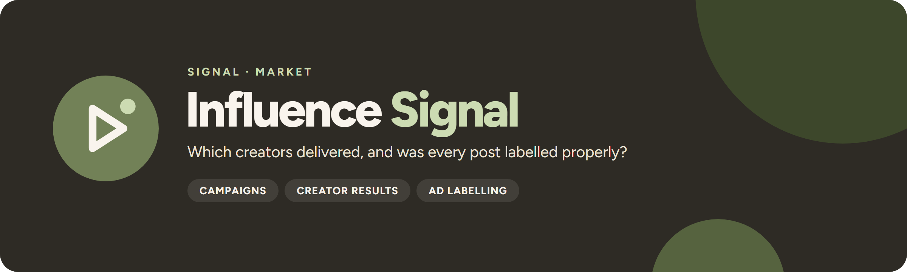

<p align="center">
  
</p>

<p align="center">
  <a href="https://github.com/UlrikErlingsen/influencer-campaigns/actions"></a>
  <a href="https://github.com/UlrikErlingsen/signal-hub"></a>
  
  
  <a href="LICENSE"></a>
</p>

<p align="center"><strong>Run Norwegian influencer campaigns in one local app — pipeline, codes, cost per result, and an advertising-label checklist on every post.</strong></p>

> **Status:** version 1.0.0 (2 October 2026). See the [changelog](CHANGELOG.md).
>
> **Name status:** developed under the working name CreatorSignal and renamed to Influence Signal (package `influencesignal`) on 1 October 2026, after a basic screen found an active product using the exact name CreatorSignal. The same screen found no product, package or GitHub repository named InfluenceSignal. That is encouraging but is not legal clearance or a trademark opinion; see [the name screen](docs/name-screen.md).

**Influence Signal** helps small brands, agencies and student projects run influencer campaigns in Norway. It combines a creator roster, a campaign pipeline, deliverables with tracked links and discount codes, cost-per-result figures and a sourced Norwegian advertising-label checklist in one open, local-first app — a free alternative to paid tools such as Upfluence, Grin and Modash.

> Which creators delivered for this campaign, at what cost per result — and was every post correctly labelled under Norwegian rules?

Everything runs on your own computer with open-source Python packages and saves to one SQLite file you choose. There is no account, telemetry, external AI call, cloud upload or social-network API.

<p align="center"></p>

## Read this first

- **Checklist support, not legal advice.** The compliance checklist records what your team checked against Forbrukertilsynet's published guidance. It never says a post or campaign is "compliant", and it is no substitute for a legal assessment.
- **Numbers are descriptive, not causal.** CPM, CPC, cost per redemption and ROAS describe what was reported against what was paid. Some buyers would have bought anyway; discount codes leak to coupon sites; views are defined differently by each platform. The app says so next to the numbers.
- **Nothing is fetched.** Follower counts, engagement rates and results are what you or the creator enter. Influence Signal never scrapes profiles, never sends DMs and never calls a platform API.
- **You hold personal data.** Creator names, contacts and fees are personal data under GDPR, and you are the data controller. See [PRIVACY.md](PRIVACY.md).

## Scope

**Version 1.0 supports:**

| Area | What you get |
|---|---|
| **Creators** | Roster with handles on Instagram, TikTok, YouTube and Snapchat, followers, engagement rate, niche tags, county (fylke), contact, rate card and notes. CSV/XLSX import with validation, CSV export. |
| **Campaigns** | Name, brand, goal (awareness / traffic / sales), budget in NOK, dates, brief, deliverables template, landing page and category. |
| **Pipeline** | Shortlist → Contacted → Negotiating → Contracted → Content in review → Published → Paid → Reported, moved with a select box on each card. Every move is logged. |
| **Deliverables** | Platform, format (reel, story, post, video), due date, agreed fee, discount code and a tracked link. |
| **Compliance** | A Norwegian advertising checklist per published deliverable. A creator cannot move to *Paid* or *Reported* until every deliverable's checklist is complete or someone writes an override reason. |
| **Results** | Reach, views, clicks, code redemptions and revenue by hand or CSV. CPM, CPC, cost per redemption and ROAS per creator and per campaign. |
| **Report** | XLSX workbook (every table, checklist answers, rule sources) and a one-page HTML summary. |

**It does not:** discover creators, scrape profiles, send outreach, handle payments or support multi-user accounts (by design in v1). To test whether influencer activity *caused* a lift, use a designed experiment with **[Experiment Signal](https://github.com/UlrikErlingsen/experiment-analysis)** rather than code redemptions.

Further limits:

- Results are self-reported. Platform analytics, screenshots and shop data disagree; record which source you used in the notes.
- One stage per creator per campaign. Deliverables carry their own checklist; the Paid gate checks all of them together.
- The restricted-category flag is a flag only. It links the source and records that someone reviewed the rules; it does not assess them.
- The SQLite file has no access control. Protect it like any file with personal data.

## Try the demo in three minutes

1. **Windows:** double-click `run_app.bat` (**macOS:** `run_app.command`). The first start creates a private Python environment, installs the packages and opens the app with the demo already loaded.
2. Open **3 · Pipeline** with *Fjellbrus Høstfjell 2026* active. Ten fictional creators sit across the stages. Move *Mathias R. (demo)* to **Paid** — the gate refuses, because his published post has no advertising label.
3. Open **5 · Compliance**. The warning names the failing rules. Open the checklist to see each rule with its source link and quote (an unofficial English translation first, the original Norwegian wording below it).
4. Switch the sidebar to *Fjellbrus Vårløp 2026* and open **6 · Results**: cost per result by creator, with the limits of each number spelled out.
5. Open **7 · Report** and download the XLSX workbook and the one-page HTML summary (print it to PDF from the browser).

**The demo is fictional.** The brand Fjellbrus, the 25 creators (handles all start with `demo_`, e-mails use `example.com`), both campaigns and every number are generated by code ([`src/influencesignal/demo.py`](src/influencesignal/demo.py), fixed seed). They represent no real person, brand or result. The demo's names, campaigns and post texts are Norwegian because the tool is built for the Norwegian market; every label, message and export field of the app itself is in English.

<p align="center"></p>

## Data contract

**Workspace.** One SQLite file, by default `./data/influencesignal.db` (git-ignored). Choose another folder on **Settings & data** or with `INFLUENCESIGNAL_DATA_DIR`. A brand-new default workspace starts with the demo; set `INFLUENCESIGNAL_NO_DEMO=1` to start empty. Unlike the analytics Signal apps, Influence Signal is a workflow tool, so it saves state.

**Creator CSV/XLSX.** Columns: `name` (required), `instagram`, `tiktok`, `youtube`, `snapchat`, `followers`, `engagement_rate` (percent, 0–100), `niche_tags` (comma separated), `region`, `contact_email`, `contact_phone`, `rate_card`, `notes`. Comma or semicolon separators and decimal commas (`4,2`) are accepted; a leading `@` on handles is removed. `region` must be one of Norway's 15 counties from 2024. Rows are rejected with their row number for missing names, impossible handles, non-numeric or negative counts, out-of-range engagement, unknown counties, malformed e-mail addresses, and duplicate names or handles. Rows whose name already exists update that creator.

| name | instagram | followers | engagement_rate | region |
|---|---|---|---|---|
| Kari T. (demo) | demo_kari_trener | 18500 | 4,2 | Vestland |

**Results CSV/XLSX.** Download the template from **6 · Results**: `deliverable_id` plus any of `reach`, `views`, `clicks`, `redemptions`, `revenue_nok`. Blank cells are left unchanged.

**Data limits.** On your own computer (standalone, a local Signal Hub or an internal company deployment) Influence Signal has no built-in limit on file size, rows or columns: memory is the limit, and running out of memory is reported as a plain message instead of a crash. Streamlit's upload cap is 10,000 MB. CSV is recommended for big files (XLSX parsing is much slower). Validation and import run column by column and in one database transaction, so a roster or results file with millions of rows validates in seconds to a minute (measured: 5 million creators, 555 MB, about 75 seconds and 4.5 GB of memory end to end). Upload screens preview the first 1,000 rows, pick lists show the first 2,000 matches with a search box, and the results chart shows the best 40 creators, each with a note; every row is still validated, imported, listed in the tables and exported. A public demo (`SIGNAL_PUBLIC=1`, set by Signal Hub's public image) caps uploads at 20 MB, 50,000 rows, 100 columns and 100 MB of expanded XLSX, and says so when a cap is hit; all caps live in [`src/influencesignal/limits.py`](src/influencesignal/limits.py).

## Methods

The workflow runs in order: roster → campaign → pipeline → deliverables with tracked links → published → checklist → Paid gate → results → report.

### Tracked links

Every link uses one scheme, so campaigns stay comparable in your analytics:

```
<landing page>?utm_source=<platform>&utm_medium=influencer&utm_campaign=<campaign slug>&utm_content=<creator handle>
```

Existing query parameters on the landing page are kept; old `utm_*` parameters are replaced. Norwegian letters are transliterated (æ → ae, ø → o, å → a).

### The Norwegian checklist

The rules live in [`src/influencesignal/rules/no.yaml`](src/influencesignal/rules/no.yaml) and can be edited without code changes. Each rule has an id, an English label and question, when it applies, the check type, the legal basis and its sources, each with an official URL, a quoted passage fetched on 1 October 2026 in the original Norwegian, and an unofficial English translation of that passage.

| Rule | Applies to | Source |
|---|---|---|
| Advertising clearly identified at the start, visible without "more" | every published deliverable | [Forbrukertilsynet's guide to labelling advertising in social media](https://www.forbrukertilsynet.no/lov-og-rett/veiledninger-og-retningslinjer/someveiledning) (updated 18 May 2026) from Forbrukertilsynet (the Norwegian Consumer Authority); § 8 of the Marketing Control Act (markedsføringsloven) |
| Label wording: «reklame» (advertisement) or «annonse» (advert), not «sponset» (sponsored), «i samarbeid med» (in collaboration with), … | every published deliverable | same guide |
| Every story frame labelled, not only the first | stories | same guide |
| Retouched-advertising mark when body shape, size or skin is altered (filters included) | deliverables that show a person | [Regulation on labelling of retouched advertising (forskrift om merking av retusjert reklame)](https://lovdata.no/dokument/SF/forskrift/2022-06-17-1114) and [Forbrukertilsynet's guide](https://www.forbrukertilsynet.no/vi-jobber-med/merking-av-retusjert-reklame/forbrukertilsynets-veiledning-om-merking-av-retusjert-reklame); markedsføringsloven § 2, in force 1 July 2022 |
| Restricted category flag: alcohol, gambling, tobacco/nicotine, targets children | campaigns in those categories | Alcohol Act (alkoholloven) § 9-2, Tobacco Control Act (tobakksskadeloven) § 22, Gambling Act (pengespilloven) § 6, markedsføringsloven §§ 19–21 |

Note on legal references: older material cites markedsføringsloven § 3 for advertising labelling. Since 1 October 2023, § 3 concerns documentation of claims, and Forbrukertilsynet's guide cites § 8 (first paragraph). Influence Signal follows the guide. One detail the official texts did not settle (whether the tobacco ban covers tobacco-free nicotine products) is marked `TODO(verify)` in the YAML — see [docs/compliance-rules.md](docs/compliance-rules.md).

### Metrics

CPM = fee ÷ views × 1,000. CPC = fee ÷ clicks. Cost per redemption = fee ÷ redemptions. ROAS = code-attributed revenue ÷ fee. Each metric counts only the fees of deliverables that reported its denominator, so a missing number never makes the rest look cheaper. A zero or missing denominator gives "–", not infinity. The results page defaults the creator comparison to the campaign goal (awareness → CPM, traffic → CPC, sales → cost per redemption).

## Decision statuses

Each deliverable's checklist has one status; the Paid gate reads them together.

- **CHECKLIST COMPLETE**: the deliverable is published and every applicable rule is answered Yes (or not applicable where the rule allows it).
- **OVERRIDE RECORDED**: open items remain, but someone wrote an override reason of at least 15 characters; the reason is written into the report.
- **ISSUE RECORDED**: at least one applicable rule is answered No. Blocks Paid unless an override is recorded.
- **ANSWERS MISSING**: the deliverable is published but at least one applicable rule is unanswered. Blocks Paid unless an override is recorded.
- **NOT PUBLISHED YET**: the checklist opens once the deliverable is marked published. Blocks Paid unless an override is recorded.

A creator moves to *Paid* or *Reported* only when every deliverable is complete or carries an override. The gate is enforced in the storage layer, not only in the UI, and the compliance page warns when a checklist is reopened after payment. None of these statuses means a post is lawful.

## Exports

The XLSX workbook and the one-page HTML summary (print it to PDF from the browser) include:

- the campaign, brand, goal, period, budget, generation date and software version (and the fictional-demo notice when it applies);
- creators, deliverables, tracked links, discount codes, fees and results;
- cost per result per creator and for the campaign, with the plain-language limits of each number;
- every checklist answer and status, override reasons, open items and the restricted-category flag;
- the rules with their legal basis, source URL and quoted passage, the date the rules were fetched, and the "Checklist support, not legal advice." disclaimer.

CSV and XLSX exports are sanitized against spreadsheet formula injection, and the HTML report escapes all user-entered text.

## Run locally

You need Python 3.10 or newer and a local copy of this folder.

**macOS:** double-click `run_app.command`. **Windows:** double-click `run_app.bat`.

The first launch creates a private `.venv` and downloads open-source dependencies. Later launches reuse it. Or use a terminal:

```bash
python -m venv .venv
source .venv/bin/activate  # Windows: .venv\Scripts\activate
python -m pip install -r requirements.txt
python -m streamlit run app.py --server.port=8590
```

Influence Signal prefers local port 8590; on macOS it falls back to a free port and, if the app is already running, just opens it. The launchers accept `INFLUENCESIGNAL_PORT`, `INFLUENCESIGNAL_MAX_UPLOAD_MB` (upload cap in MB, default 10000, passed to `--server.maxUploadSize`) and, on macOS, `INFLUENCESIGNAL_NO_BROWSER=1` to skip opening the browser. Set `INFLUENCESIGNAL_DEBUG=1` to show technical details for unexpected errors, and `INFLUENCESIGNAL_RULES=<path>` to load a different rules YAML.

### Docker

```bash
docker build -t influencesignal .
docker run --rm -p 8590:8590 -v influencesignal-data:/data influencesignal
```

Then open http://127.0.0.1:8590. The container runs as a non-root user, stores the database in the `/data` volume and includes a health check. The upload cap is set with `STREAMLIT_SERVER_MAX_UPLOAD_SIZE=10000` in the image; override it with `docker run -e STREAMLIT_SERVER_MAX_UPLOAD_SIZE=<MB> …`. It has no authentication — do not expose it beyond your own machine without adding access control (see [SECURITY.md](SECURITY.md)).

### Inside Signal Hub

[Signal Hub](https://github.com/UlrikErlingsen/signal-hub) imports the package and calls `influencesignal.ui.render()` with `SIGNAL_HUB=1`. In that mode each browser session gets its own **in-memory** SQLite workspace, seeded with the fictional demo: nothing is read from or written to disk, an existing local workspace is never opened, the database-folder settings and the `INFLUENCESIGNAL_RULES` override are off (the app says so on *Settings & data*), and the app makes no network requests. Everything typed in the Hub is gone when the tab closes, so use the local app for real campaigns. Checklist support, not legal advice — in the Hub as everywhere else.

## Privacy

Creator names, contacts, fees and notes are processed and stored only in the SQLite file on the computer that runs the app (in Signal Hub: only in that browser session's memory); you are the data controller for them. Whoever runs Influence Signal on a server is responsible for that deployment's access control, logs, backups and retention. See [PRIVACY.md](PRIVACY.md).

## Development

```bash
python -m pip install -e ".[test]"
python -m pytest
python -m ruff check .
python -m build
```

The suite covers metric calculations, the UTM builder, rule loading and validation, the "cannot mark Paid without a checklist" gate, CSV import validation, the deterministic demo, report exports, every Streamlit page, the Signal brand shell, the architecture rules, the Signal Hub contract (`render()` from the packaged files, namespaced keys, and hub mode writing no file and making no network call), and an end-to-end run through the UI from an empty workspace (campaign → creator → shortlist → deliverable → publish → checklist → Paid → results → report). README screenshots are made with [`scripts/take_screenshots.py`](scripts/take_screenshots.py).

**Architecture.**

- `src/influencesignal/` — all logic, data models and storage, pip-installable, **no Streamlit imports** except in `src/influencesignal/ui/`. Public API in [`__init__.py`](src/influencesignal/__init__.py). Streamlit and Plotly are in the `ui` extra (`pip install "influencesignal[ui]"`); `requirements.txt` installs everything.
- `src/influencesignal/storage.py` — the only module that touches SQLite, so the backend can be swapped. `Store(":memory:")` is a private in-memory workspace (used by Signal Hub).
- `src/influencesignal/ui/` — the Streamlit UI: `pages/` (one module per page, each exposing `render()`), `shell.py` (workspace, namespaced keys via `k()`, notes, pipeline cards, display helpers), `app.py` (page list, sidebar, masthead, footer and `render()`), and `__init__.py` with `APP_INFO` and `render()` for Signal Hub. `signal_theme.py` and the marks are synced from Signal Hub; edit them there, not here.
- `app.py` — standalone entry point: page config, wires the same pages into `st.navigation`, renders the sidebar, masthead and footer, and runs the selected page. `?page=<slug>` opens a page directly (e.g. `/?page=compliance&campaign=fjellbrus-hostfjell-2026`); each page also has its own path such as `/compliance`.
- `tests/test_architecture.py` fails if Streamlit is imported outside `app.py` and `src/influencesignal/ui/`, if SQLite leaks outside `storage.py`, or if a page module lacks `render()`; `tests/test_hub_contract.py` checks the Signal Hub contract.

## Where this fits in Signal

Influence Signal is the Market family's campaign workflow tool: it follows planning in [Season Signal](https://github.com/UlrikErlingsen/marketing-calendar) and listening in [Listen Signal](https://github.com/UlrikErlingsen/media-listening), and hands causal questions to [Experiment Signal](https://github.com/UlrikErlingsen/experiment-analysis).

<!-- signal-suite:start (generated from signal-hub/apps.yaml by scripts/sync_readme_suite.py) -->
| Family | App | Asks |
|---|---|---|
| Brand | [Track Signal](https://github.com/UlrikErlingsen/brand-tracking) | Is the brand moving, or is the tracker just noisy? |
| Brand | [Position Signal](https://github.com/UlrikErlingsen/brand-positioning) | Where do brands sit relative to competitors? |
| Market | [Prospect Signal](https://github.com/UlrikErlingsen/b2b-prospecting) | Which Norwegian companies fit your ideal customer, and which first? |
| Market | [Listen Signal](https://github.com/UlrikErlingsen/media-listening) | Who is talking about the brand in Norwegian media, and in what tone? |
| Market | **Influence Signal** (this app) | Which creators delivered, and was every post labelled properly? |
| Market | [Season Signal](https://github.com/UlrikErlingsen/marketing-calendar) | What does the Norwegian marketing year look like, worked backwards? |
| Market | [Adopt Signal](https://github.com/UlrikErlingsen/adoption-forecasting) | When will a new product be adopted? |
| Market | [Rival Signal](https://github.com/UlrikErlingsen/competitor-analysis) | Which rivals matter, and how could they respond? |
| Market | [Reach Signal](https://github.com/UlrikErlingsen/location-catchment-analysis) | Where could a new location reach, and how would it share demand with existing sites? |
| Customer | [Worth Signal](https://github.com/UlrikErlingsen/customer-value-analytics) | What are customers and relationships worth? |
| Customer | [Segment Signal](https://github.com/UlrikErlingsen/customer-segmentation) | Do customers form stable, useful groups? |
| Customer | [Trace Signal](https://github.com/UlrikErlingsen/journey-path-analysis) | How do logged customer journeys actually unfold? |
| Customer | [Blueprint Signal](https://github.com/UlrikErlingsen/service-blueprinting) | How is the customer experience actually delivered, and where do the handoffs fail? |
| Customer | [Recommend Signal](https://github.com/UlrikErlingsen/recommender-evaluation) | Which recommendation policy should be tested live? |
| Research | [Choice Signal](https://github.com/UlrikErlingsen/conjoint-analysis) | How do product attributes drive choice? |
| Research | [Driver Signal](https://github.com/UlrikErlingsen/survey-driver-analysis) | Which measured experiences move with satisfaction? |
| Research | [Measure Signal](https://github.com/UlrikErlingsen/measurement-validation) | Does a multi-item score have a defensible structure? |
| Research | [Text Signal](https://github.com/UlrikErlingsen/open-text-analysis) | What recurring patterns appear in open-ended responses? |
| Research | [Tag Signal](https://github.com/UlrikErlingsen/pricing-analysis) | What price range is supported, and how does profit move? |
| Research | [Learn Signal](https://github.com/UlrikErlingsen/research-prioritization) | Which uncertainty is worth paying to research before you decide? |
| Decide | [Experiment Signal](https://github.com/UlrikErlingsen/experiment-analysis) | Did the treatment cause a practically meaningful change? |
| Decide | [Gate Signal](https://github.com/UlrikErlingsen/launch-decision-gate) | Does a concept deserve the next investment? |
| Decide | [Shift Signal](https://github.com/UlrikErlingsen/cannibalization-analysis) | Does a launch grow the portfolio, or move existing demand around? |
| Decide | [Alloc Signal](https://github.com/UlrikErlingsen/marketing-mix-allocation) | Where should the next marketing budget go? |

All 24 apps run side by side in [Signal Hub](https://github.com/UlrikErlingsen/signal-hub), each opening with fictional demo data. Every repo carries the [`signal-suite`](https://github.com/topics/signal-suite) topic, and the suite is listed at [ulrikerlingsen.com](https://ulrikerlingsen.com). Freddo CRM is a separate product.
<!-- signal-suite:end -->

## References

Official sources quoted in the rules (fetched 1 October 2026; dates are the sources' own "last updated" where shown):

- Forbrukertilsynet. (2026, 18 May). *Veileder for merking av reklame i sosiale medier* [Guide to labelling advertising in social media]. https://www.forbrukertilsynet.no/lov-og-rett/veiledninger-og-retningslinjer/someveiledning
- Forbrukertilsynet. (2025, 11 April). *Merking av retusjert reklame* [Labelling of retouched advertising]. https://www.forbrukertilsynet.no/vi-jobber-med/merking-av-retusjert-reklame
- Forbrukertilsynet. (2026, 18 August). *Forbrukertilsynets veiledning om merking av retusjert reklame* [Forbrukertilsynet's guidance on labelling retouched advertising]. https://www.forbrukertilsynet.no/vi-jobber-med/merking-av-retusjert-reklame/forbrukertilsynets-veiledning-om-merking-av-retusjert-reklame
- Forbrukertilsynet. (2025, 29 September). *Ofte stilte spørsmål om retusjert reklame* [Frequently asked questions about retouched advertising]. https://www.forbrukertilsynet.no/vi-jobber-med/merking-av-retusjert-reklame/ofte-stilte-sporsmal-om-retusjert-reklame
- Forbrukertilsynet. *Barn kan se og høre reklamen din* [Children can see and hear your advertising]. https://www.forbrukertilsynet.no/vi-jobber-med/barn-og-unge/barn-og-reklame/barn-kan-se-og-hore-reklamen-din
- Forskrift om merking av retusjert reklame [Regulation on labelling of retouched advertising] (FOR-2022-06-17-1114). https://lovdata.no/dokument/SF/forskrift/2022-06-17-1114
- Lov om kontroll med markedsføring og avtalevilkår mv. (markedsføringsloven) [Marketing Control Act], LOV-2009-01-09-2, §§ 2, 8 and 19–21. https://lovdata.no/dokument/NL/lov/2009-01-09-2
- Alkoholloven [Alcohol Act], LOV-1989-06-02-27, § 9-2. https://lovdata.no/dokument/NL/lov/1989-06-02-27/§9-2
- Tobakksskadeloven [Tobacco Control Act], LOV-1973-03-09-14, § 22. https://lovdata.no/dokument/NL/lov/1973-03-09-14/§22
- Helsedirektoratet. (2026, 12 May). *Forbud mot reklame (tobakksskadeloven)* [Advertising ban (Tobacco Control Act)]. https://www.helsedirektoratet.no/veiledere/tobakksskadeloven/reklameforbud
- Pengespilloven [Gambling Act], LOV-2022-03-18-12, § 6. https://lovdata.no/dokument/NL/lov/2022-03-18-12/§6

See [docs/compliance-rules.md](docs/compliance-rules.md) for how each source maps to a rule and what is still open.

## Originality and license

Influence Signal is an independent implementation based on public Norwegian legal sources and official guidance, standard marketing cost-per-result definitions and original fictional examples. It does not reproduce paid tools' interfaces or content, lecture slides, course cases or other institution-specific material. Rule texts quote short passages from the official sources listed above, with links and fetch dates; see [the compliance-rule notes](docs/compliance-rules.md).

The software and documentation are free under AGPL-3.0-or-later. See [LICENSE](LICENSE). Contributing: [CONTRIBUTING.md](CONTRIBUTING.md). Security: [SECURITY.md](SECURITY.md). Changes: [CHANGELOG.md](CHANGELOG.md).

This application was developed with AI coding assistance and checked with automated tests and visual inspection. Rule texts quote official sources fetched on the date shown; verify them before relying on them. No warranty is provided.

---

<p>
  
  <strong>Influence Signal</strong> is part of <a href="https://github.com/UlrikErlingsen/signal-hub"><strong>Signal</strong></a>, open marketing-evidence tools by <a href="https://ulrikerlingsen.com">Ulrik Erlingsen</a>.
</p>
